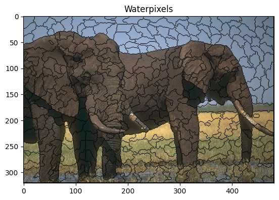

# Waterpixels Project

Authors:
Yanis Aît El Cadi,
Zakaria Chahboune

This project demonstrates the use of image processing techniques to segment images into superpixels using waterpixels. The provided Jupyter notebook contains step-by-step implementations and visualizations of the process.

## Table of Contents
- [Introduction](#introduction)
- [Requirements](#requirements)
- [Usage](#usage)
- [Notebook Overview](#notebook-overview)
- [Results](#results)

## Introduction
Superpixel segmentation is a preprocessing step in many computer vision tasks. This project uses a waterpixels approach, which leverages watershed segmentation techniques. The notebook explains each step of the process, including image preprocessing, gradient calculation, and the final segmentation.

## Requirements
To run the notebook, you need the following packages:
- Python 3.x
- NumPy
- OpenCV
- Matplotlib
- Scikit-Image

You can install the required packages using pip:
```sh
pip install numpy opencv-python matplotlib scikit-image
```

## Usage
1. Clone the repository:
   ```sh
   git clone https://github.com/yourusername/waterpixels-project.git
   ```
2. Navigate to the project directory:
   ```sh
   cd waterpixels-project
   ```
3. Open the Jupyter notebook:
   ```sh
   jupyter notebook Waterpixels.ipynb
   ```
4. Run the cells in the notebook to see the step-by-step implementation and results.

## Notebook Overview
The notebook includes the following sections:
1. **Image Preprocessing**: Loading and converting images to grayscale.
2. **Morphological Operations**: Applying opening and closing operations.
3. **Gradient Calculation**: Computing the gradient of the image.
4. **Markers and Watershed**: Creating markers and applying the watershed algorithm.
5. **Visualization**: Displaying the results of each step.

## Results
The notebook provides visualizations at each step of the process, allowing you to understand the intermediate results and the final waterpixel segmentation. Here is an example of the output:


